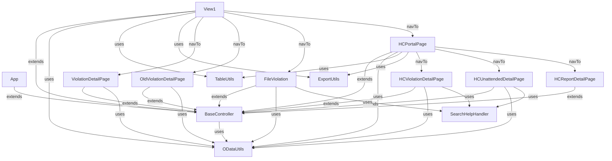

# Graphy Codebase Analysis

### File Structure Summary
- Total Files: 60
- Total Directories: 16
- File Extensions: .zip: 1, .mjs: 1, .json: 3, .md: 1, .yaml: 4, .js: 27, .html: 4, .css: 1, .properties: 2, .xml: 16

### Directory Tree
```
  ├── archive.zip
  ├── eslint.config.mjs
  ├── package-lock.json
  ├── package.json
  ├── README.md
  ├── ui5-deploy.yaml
  ├── ui5-local.yaml
  ├── ui5-mock.yaml
  ├── ui5.yaml
  └── webapp
     ├── Component.js
     ├── controller
      │  ├── App.controller.js
      │  ├── BaseController.js
      │  ├── FileViolation.controller.js
      │  ├── HCPortalPage.controller.js
      │  ├── HCReportDetailPage.controller.js
      │  ├── HCUnattendedDetailPage.controller.js
      │  ├── HCViolationDetailPage.controller.js
      │  ├── OldViolationDetailPage.controller.js
      │  ├── View1.controller.js
      │  └── ViolationDetailPage.controller.js
     ├── css
      │  └── style.css
     ├── i18n
      │  ├── i18n.properties
      │  └── i18n_en.properties
     ├── index.html
     ├── localService
      │  └── mainService
      │    └── metadata.xml
     ├── manifest.json
     ├── model
      │  └── models.js
     ├── test
      │  ├── integration
      │  │  ├── AllJourneys.js
      │  │  ├── arrangements
      │  │  │  └── Startup.js
      │  │  ├── NavigationJourney.js
      │  │  ├── opaTests.qunit.html
      │  │  ├── opaTests.qunit.js
      │  │  └── pages
      │  │    ├── App.js
      │  │    └── View1.js
      │  ├── testsuite.qunit.html
      │  ├── testsuite.qunit.js
      │  └── unit
      │    ├── AllTests.js
      │    ├── controller
      │     │  ├── BaseController.js
      │     │  └── View1.controller.js
      │    ├── unitTests.qunit.html
      │    └── unitTests.qunit.js
     ├── utils
      │  ├── ExportUtils.js
      │  ├── ODataUtils.js
      │  ├── SearchHelpHandler.js
      │  └── TableUtils.js
     └── view
        ├── App.view.xml
        ├── FileViolation.view.xml
        ├── fragments
         │  ├── AddRemarkDialog.fragment.xml
         │  ├── HCDialog.fragment.xml
         │  ├── RegularizeDialog.fragment.xml
         │  ├── ReportToHCDialog.fragment.xml
         │  ├── TakeActionDialog.fragment.xml
         │  └── TakeNoActionDialog.fragment.xml
        ├── HCPortalPage.view.xml
        ├── HCReportDetailPage.view.xml
        ├── HCUnattendedDetailPage.view.xml
        ├── HCViolationDetailPage.view.xml
        ├── OldViolationDetailPage.view.xml
        ├── View1.view.xml
        └── ViolationDetailPage.view.xml
```


### Controller Function Tree

Legend: `[LC]` Lifecycle · `[EH]` Event Handler · `[PH]` Private Helper · `[OD]` OData · `[FMT]` Formatter

```
controller/
│
├── BaseController.js  ──────────────────────────────────────────────────
│   (extends sap/ui/core/mvc/Controller)
│   │
│   ├── [FMT] formatEdmTime(edmTime)
│   ├── [FMT] toTimeString(edmTime)
│   ├── [FMT] timeStringToSeconds(timeStr)
│   ├── [FMT] secondsToTimeString(totalSeconds)
│   ├── [FMT] normalizeOvernightSeconds(schInSeconds, valueSeconds)
│   ├── [FMT] hasAttendanceTimeDifference(record)
│   ├── [FMT] formatVisibility(value)
│   ├── [FMT] formatZstatus(status)
│   ├── [FMT] formatZaction(action)
│   ├── [FMT] displaydateFormatter(value)
│   ├── [FMT] formatRemarkColor(text)
│   ├── [OD]  loadMediaFiles(violationRec, modelName?)
│   ├── [PH]  clearFileUploadState(uploaderId)
│   ├── [OD]  downloadMediaFile(item)
│   ├── [OD]  loadRemarks(violationRec, dialog)
│   └── [EH]  onNavBack()
│
├── App.controller.js  ──────────────────────────────────────────────────
│   (extends BaseController)
│   │
│   └── [LC]  onInit()
│
├── FileViolation.controller.js  ────────────────────────────────────────
│   (extends BaseController)
│   │
│   ├── [LC]  onInit()
│   ├── [PH]  _onRouteMatched()
│   ├── [EH]  onFileChange(oEvent)
│   ├── [EH]  onValueHelpRequest(oEvent)
│   ├── [PH]  _formatDateToString(date)
│   ├── [EH]  onValueHelpLiveSearch(oEvent)
│   ├── [EH]  onValueHelpClose(oEvent)
│   ├── [EH]  onCancel()
│   ├── [EH]  onIncidentDateChange(oEvent)
│   ├── [EH]  onSave()
│   ├── [OD]  UploadFiles(files, zactionRefNo)
│   └── [PH]  _getSelectedEmployeeData()
│
├── HCPortalPage.controller.js  ─────────────────────────────────────────
│   (extends BaseController)
│   │
│   ├── [LC]  onInit()
│   ├── [PH]  _onRouteMatched()
│   ├── [EH]  onSearchHistory(oEvent)
│   ├── [EH]  onRefreshHistory()
│   ├── [EH]  onExportHCData()
│   ├── [EH]  onViewDetails(oEvent)
│   ├── [EH]  onViewCompletedDetails(oEvent)
│   ├── [OD]  _loadHCViolations()
│   ├── [OD]  _loadHCNew()
│   ├── [OD]  _loadHCCompleted()
│   ├── [EH]  onTabSelect(oEvent)
│   ├── [EH]  onSearchNew(oEvent)
│   ├── [EH]  onRefreshNew()
│   ├── [EH]  onExportNew()
│   ├── [EH]  onSearchCompleted(oEvent)
│   ├── [EH]  onRefreshCompleted()
│   ├── [EH]  onViewNewDetails(oEvent)
│   ├── [EH]  onExportCompleted()
│   ├── [OD]  _loadHCReport()
│   ├── [EH]  onSearchReport(oEvent)
│   ├── [EH]  onRefreshReport()
│   ├── [EH]  onExportReport()
│   └── [EH]  onViewReportDetails(oEvent)
│
├── HCReportDetailPage.controller.js  ───────────────────────────────────
│   (extends BaseController)
│   │
│   ├── [LC]  onInit()
│   ├── [PH]  _onRouteMatched()
│   ├── [EH]  onMediaFilePress(oEvent)
│   ├── [EH]  onViewRemarkPress()
│   ├── [FMT] formatRemarkColor(text)
│   └── [EH]  onViewRemarkCancel()
│
├── HCUnattendedDetailPage.controller.js  ───────────────────────────────
│   (extends BaseController)
│   │
│   ├── [LC]  onInit()
│   ├── [PH]  _onRouteMatched()
│   ├── [EH]  onMediaFilePress(oEvent)
│   ├── [PH]  _getSelectedCategory()
│   ├── [EH]  onFileChange(oEvent)
│   ├── [EH]  onReportToHCPress()
│   ├── [EH]  onReportToHCSubmit()
│   ├── [EH]  onReportToHCCancel()
│   ├── [OD]  UploadFiles(files, zactionRefNo)
│   ├── [EH]  onTakeNoActionPress()
│   ├── [PH]  _populateRegularizeModel(record)
│   ├── [PH]  _getScheduleOutDate(incDate, isNightShift)
│   ├── [EH]  onRegularizeSubmit()
│   ├── [EH]  onRegularizeCancel()
│   ├── [PH]  _openRegularizeDialog()
│   ├── [EH]  onCloseTakeNoActionDialog()
│   ├── [EH]  onViewRemarkPress()
│   ├── [FMT] formatRemarkColor(text)
│   ├── [EH]  onViewRemarkCancel()
│   ├── [EH]  onSubmitTakeNoAction()
│   ├── [EH]  onValueHelpRequest(oEvent)
│   ├── [EH]  onValueHelpLiveSearch(oEvent)
│   ├── [OD]  _submitToITMSet(payload, successMsg, onSuccess, errorTitle)
│   ├── [EH]  onPayrollDeductionPress()
│   ├── [EH]  onValueHelpClose()
│   └── [OD]  _submitHCAction(violationRecord, overrides, closeDialog)
│
├── HCViolationDetailPage.controller.js  ────────────────────────────────
│   (extends BaseController)
│   │
│   ├── [LC]  onInit()
│   ├── [EH]  onViewHCDialog()
│   ├── [EH]  onCloseHCDialog()
│   ├── [EH]  onAddQAPair()
│   ├── [EH]  onRemoveQAPair(oEvent)
│   ├── [EH]  onSaveQAPairs()
│   ├── [PH]  _onRouteMatched()
│   ├── [EH]  onFileChange(oEvent)
│   ├── [EH]  onMediaFilePress(oEvent)
│   ├── [PH]  _getSelectedCategory()
│   ├── [EH]  onTakeActionPress()
│   ├── [EH]  onCloseTakeActionDialog()
│   ├── [EH]  onRepeatCountChange(oEvent)
│   ├── [EH]  onSubmitTakeAction()
│   ├── [EH]  onTakeNoActionPress()
│   ├── [PH]  _populateRegularizeModel(record)
│   ├── [PH]  _getScheduleOutDate(incDate, isNightShift)
│   ├── [EH]  onRegularizeSubmit()
│   ├── [EH]  onRegularizeCancel()
│   ├── [PH]  _openRegularizeDialog()
│   ├── [EH]  onCloseTakeNoActionDialog()
│   ├── [EH]  onViewRemarkPress()
│   ├── [FMT] formatRemarkColor(text)
│   ├── [EH]  onViewRemarkCancel()
│   ├── [EH]  onSubmitTakeNoAction()
│   ├── [EH]  onValueHelpRequest(oEvent)
│   ├── [EH]  onValueHelpLiveSearch(oEvent)
│   ├── [EH]  onPayrollDeductionPress()
│   ├── [EH]  onValueHelpClose()
│   ├── [OD]  _submitHCAction(violationRecord, overrides, closeDialog)
│   ├── [EH]  onAppealPress()
│   ├── [OD]  UploadFiles(files, zactionRefNo, violationRec, actionData)
│   └── [EH]  onSendBackToLMPress()
│
├── OldViolationDetailPage.controller.js  ───────────────────────────────
│   (extends BaseController)
│   │
│   ├── [LC]  onInit()
│   ├── [PH]  _onRouteMatched()
│   ├── [EH]  onMediaFilePress(oEvent)
│   ├── [EH]  onViewRemarkPress()
│   ├── [FMT] formatRemarkColor(text)
│   └── [EH]  onViewRemarkCancel()
│
├── View1.controller.js  ────────────────────────────────────────────────
│   (extends BaseController — Main LM Dashboard)
│   │
│   ├── [LC]  onInit()
│   ├── [PH]  _onColumnFilter(context, oEvent)
│   ├── [EH]  onTabSelect(oEvent)
│   ├── [EH]  onMissPunchSelectionChange(oEvent)
│   ├── [FMT] formatMissPunchHighlight(punchIn, punchOut)
│   ├── [FMT] isPunchOutEditable(punchIn, punchOut)
│   ├── [FMT] isPunchInEditable(punchIn, punchOut)
│   ├── [EH]  onMissPunchTimeChange(oEvent)
│   ├── [EH]  onSubmitMissPunch()                        [async]
│   ├── [EH]  onSearch()                                 [async]
│   ├── [OD]  _loadCurrentViolations()                   [async]
│   ├── [OD]  _loadHistoryViolations()
│   ├── [EH]  onRefreshCurrent()
│   ├── [EH]  onRefreshHistory()
│   ├── [EH]  onSearchCurrent(oEvent)
│   ├── [EH]  onSearchHistory(oEvent)
│   ├── [EH]  onExportCurrent()
│   ├── [EH]  onExportHistory()
│   ├── [EH]  onViewDetails(oEvent)
│   ├── [EH]  onViewDetailsHistory(oEvent)
│   ├── [PH]  _navigateToDetailPage(record, sourceContext)
│   ├── [EH]  onCreateViolation()
│   ├── [EH]  onHCPortal()
│   ├── [OD]  _loadMissPunch()
│   ├── [EH]  onRefreshMissPunch()
│   ├── [EH]  onSearchMissPunch(oEvent)
│   ├── [EH]  onExportMissPunch()
│   ├── [EH]  onViewMissPunchDetails(oEvent)
│   └── [EH]  onAutofillMissPunch()
│
└── ViolationDetailPage.controller.js  ──────────────────────────────────
    (extends BaseController — LM Violation Detail)
    │
    ├── [LC]  onInit()
    ├── [PH]  _onRouteMatched(oEvent)
    ├── [EH]  onFileChange(oEvent)
    ├── [EH]  onMediaFilePress(oEvent)
    ├── [EH]  onRegularizePress()
    ├── [PH]  _populateRegularizeModel(record)
    ├── [EH]  onRegularizeModeChange(oEvent)
    ├── [PH]  _getScheduleOutDate(incDate, isNightShift)
    ├── [EH]  onRegularizeSubmit()
    ├── [EH]  onRegularizeCancel()
    ├── [EH]  onReportToHCPress()
    ├── [EH]  onReportToHCSubmit()
    ├── [OD]  UploadFiles(files, zactionRefNo)
    ├── [EH]  onReportToHCCancel()
    ├── [EH]  onPayrollDeductionPress()
    ├── [PH]  _openDialog(dialogKey, fragmentName)
    ├── [PH]  _closeDialog(dialogKey)
    ├── [OD]  _submitToITMSet(payload, successMsg, onSuccess, errorTitle)
    ├── [PH]  _formatIncidentDateDisplay(dateValue)
    ├── [PH]  _formatHoursDisplay(hoursValue)
    └── [PH]  _buildEmptyRegularizeState()
```

### Function Summary by Controller

| Controller | LC | EH | PH | OD | FMT | Total |
|---|---|---|---|---|---|---|
| BaseController | 0 | 1 | 1 | 3 | 11 | **16** |
| App | 1 | 0 | 0 | 0 | 0 | **1** |
| FileViolation | 1 | 6 | 3 | 1 | 0 | **11** |
| HCPortalPage | 1 | 16 | 2 | 3 | 0 | **22** |
| HCReportDetailPage | 1 | 3 | 1 | 0 | 1 | **6** |
| HCUnattendedDetailPage | 1 | 12 | 4 | 4 | 1 | **22** |
| HCViolationDetailPage | 1 | 18 | 4 | 3 | 1 | **27** |
| OldViolationDetailPage | 1 | 3 | 1 | 0 | 1 | **6** |
| View1 | 1 | 18 | 2 | 3 | 3 | **27** |
| ViolationDetailPage | 1 | 9 | 7 | 3 | 0 | **20** |
| **Total** | **9** | **86** | **25** | **20** | **18** | **158** |

---

### Utils Function Tree

Legend: `[PUB]` Public API · `[PRV]` Private/Internal · `[FMT]` Formatter · `[OD]` OData Operation · `[DEP]` Deprecated alias

```
utils/
│
├── ODataUtils.js  ──────────────────────────────────────────────────────
│   (Singleton object — no class inheritance)
│   │
│   ├── ── Private module-scope helpers ───────────────────────────────
│   ├── [PRV] parseByteField(value)
│   ├── [PRV] safeStr(value)
│   ├── [PRV] secondsToTimeString(totalSeconds)
│   ├── [PRV] pad2(n)
│   │
│   ├── ── Public API ──────────────────────────────────────────────────
│   ├── [OD]  handleODataError(error, title)
│   ├── [OD]  fetchOData(oDataModel, entitySetPath, filters)             → Promise<results[]>
│   ├── [OD]  fetchODataEntity(oDataModel, entityPath)                   → Promise<entity>
│   ├── [OD]  fetchODataAll(oDataModel, entitySetPath, filters, pageSize)→ Promise<results[]>
│   ├── [FMT] formatEdmTime(edmTime)                                     → "HH:mm:ss"
│   ├── [PUB] getCurrentUserId()                                         → string
│   ├── [PUB] getCurrentUserName()                                       → string
│   ├── [FMT] formatTimeForPayload(timeString)                           → Edm.Time { ms, __edmType }
│   ├── [FMT] formatDateTimeForPayload(dateValue)                        → "/Date(...)/"
│   ├── [FMT] formatTimeDurationForPayload(timeValue)                    → "PxxDTxxHxxMxxS"
│   ├── [FMT] formatDateTimeForEntityKey(dateValue)                      → "yyyy-MM-ddTHH:mm:ss"
│   ├── [PUB] parseByte                                                  (alias → parseByteField)
│   ├── [PUB] buildITMPayload(violationRecord, overrides)                → ITM_STRSet payload
│   ├── [PUB] buildPunchRegularizePayload(violationRecord, overrides)    → punch_regularize payload
│   ├── [PUB] normalizePayloadForOData(payload)                          → normalized payload
│   ├── [OD]  submitHCAction(oDataModel, violationRecord, overrides)     → Promise (UPDATE)
│   ├── [OD]  submitPunchRegularize(oDataModel, violationRecord, overrides) → Promise (UPDATE)
│   ├── [OD]  submitSFRegularize(oDataModel, violationRecord, overrides) → Promise (UPDATE)
│   │
│   └── ── Deprecated aliases ──────────────────────────────────────────
│       ├── [DEP] getuserId()                → getCurrentUserId()
│       ├── [DEP] formatDateTimeForKey()     → formatDateTimeForEntityKey()
│       ├── [DEP] _formatPayloadForOData()   → normalizePayloadForOData()
│       └── [DEP] submitTakeAction()         → submitHCAction()
│
├── TableUtils.js  ──────────────────────────────────────────────────────
│   (Singleton object)
│   │
│   ├── [PUB] buildTableColumns(table, columnConfigs, timeFormatter,
│   │         dateFormatter, statusFormatter, actionFormatter, modelPrefix)
│   │         → Dynamically adds sap.ui.table.Column instances to a table.
│   │         → Supports: isTime, isDate, isStatus, isAction, editableConfig
│   │
│   └── [PUB] applyTableSearch(table, columnConfigs, searchQuery)
│             → Applies an OR filter across all visible filterProperty columns.
│             → Falls back from server-side to client-side filter on error.
│
├── ExportUtils.js  ─────────────────────────────────────────────────────
│   (Singleton object)
│   │
│   ├── ── Private module-scope helpers ───────────────────────────────
│   ├── [PRV] resolveEdmType(columnConfig)        → sap.ui.export.EdmType
│   ├── [PRV] defaultFormatEdmTime(edmTime)        → "HH:mm:ss"
│   ├── [PRV] defaultFormatEdmDate(dateValue)      → "yyyy-MM-dd"
│   │
│   └── [PUB] exportTableToExcel(table, columnConfigs, fileName,
│             timeFormatter, statusFormatter, actionFormatter)
│             → Reads all bound rows, pre-formats time/date/status/action
│               columns, then triggers sap.ui.export.Spreadsheet download.
│
└── SearchHelpHandler.js  ───────────────────────────────────────────────
    (Singleton object)
    │
    ├── ── Private module-scope helpers ───────────────────────────────
    ├── [PRV] formatDateForODataKey(dateValue)     → "yyyy-MM-ddT00:00:00"
    ├── [PRV] dialogCacheKey(inputId)              → "_valueHelpDialog_<id>"
    │
    ├── ── Public API ──────────────────────────────────────────────────
    ├── [OD]  fetchEntitySet(controller, modelName, entitySetPath, filters)
    │         → Promise<results[]>  (generic OData read helper)
    │
    ├── [OD]  loadRepeatInfo(controller, employeeId, category,
    │         incidentType, incidentDate, actionRefNo)
    │         → Reads FIST_INC_DATESet and writes Zrepeatcount /
    │           Zsysrepeatcount / ZfirstIncDate into "regularize" model.
    │
    ├── [PRV] _createDialog(controller, view, inputId, fieldConfig, targetInput)
    │         → Builds and returns a cached sap.m.SelectDialog with
    │           live-search, ESC handler, and valueHelpItems model.
    │
    ├── [PUB] openValueHelpDialog(controller, triggerEvent, extraParam)
    │         → Opens (or reuses cached) SelectDialog for a given input.
    │           Applies defaultFilters + category/date extraParam filters,
    │           then populates via fetchEntitySet.
    │
    ├── [PUB] onLiveSearch(oEvent)
    │         → Client-side filters dialog._allData by key + description.
    │
    ├── [PUB] onConfirm(controller, oEvent)
    │         → Sets the target input value, stores selectedEmployeeData
    │           in SHData model, triggers detail fetch for inputZempId,
    │           and calls loadRepeatInfo for dIpZincType selections.
    │
    └── ── Deprecated aliases ──────────────────────────────────────────
        ├── [DEP] liveSearchValueHelpDialog()  → onLiveSearch()
        ├── [DEP] searchValueHelpDialog()      → onLiveSearch()
        ├── [DEP] closeValueHelpDialog()       → onConfirm()
        └── [DEP] fetchGLData()               → fetchEntitySet()
```

### Utils Function Summary

| Util | Public | Private | Formatters | OData | Deprecated | Total |
|---|---|---|---|---|---|---|
| ODataUtils | 7 | 4 | 7 | 5 | 4 | **27** |
| TableUtils | 2 | 0 | 0 | 0 | 0 | **2** |
| ExportUtils | 1 | 3 | 0 | 0 | 0 | **4** |
| SearchHelpHandler | 3 | 3 | 0 | 2 | 4 | **12** |
| **Total** | **13** | **10** | **7** | **7** | **8** | **45** |

> **Cross-cutting note:** `ODataUtils` is consumed by all other utils and all controllers.
> `TableUtils` + `ExportUtils` are consumed only by dashboard controllers (`View1`, `HCPortalPage`).
> `SearchHelpHandler` is consumed only by controllers that have a value-help input (`FileViolation`, `HCViolationDetailPage`, `HCUnattendedDetailPage`).

---

### Controller Dependency Graph

Categories: **SAP** = UI5 framework modules · **Local** = project files · **Fragment** = XML fragments loaded at runtime · **OData** = entity sets read/written · **Route** = pages navigated to

---

#### `App.controller.js`
| Category | Dependency |
|---|---|
| SAP | `sap/ui/core/mvc/Controller` |
| Local | — |
| Fragment | — |
| OData | — |
| Route | — |

---

#### `BaseController.js`  *(inherited by all controllers below)*
| Category | Dependency |
|---|---|
| SAP | `sap/ui/core/mvc/Controller` |
| SAP | `sap/ui/core/routing/History` |
| SAP | `sap/ui/core/format/DateFormat` |
| SAP | `sap/ui/model/json/JSONModel` |
| SAP | `sap/ui/model/Filter` · `FilterOperator` |
| Local | `utils/ODataUtils` |
| OData | `/ZHR_GET_MEDIASet` (read) |
| OData | `/GET_REMARKSSet` (read) |
| OData | `/ZHR_SANC_MEDIAUPLOADSet` (GET — download) |
| Route | `RouteView1` (fallback nav-back) |

---

#### `FileViolation.controller.js`
| Category | Dependency |
|---|---|
| SAP | `sap/m/MessageToast` · `sap/m/MessageBox` |
| SAP | `sap/ui/model/json/JSONModel` |
| Local | `controller/BaseController` *(extends)* |
| Local | `utils/ODataUtils` |
| Local | `utils/SearchHelpHandler` |
| Fragment | — |
| OData | `/ITM_STRSet` (create) |
| OData | `/ZHR_SANC_MEDIAUPLOADSet` (POST — upload) |
| Route | `RouteFileViolation` (self — matched) |

---

#### `HCPortalPage.controller.js`
| Category | Dependency |
|---|---|
| SAP | `sap/ui/model/json/JSONModel` |
| SAP | `sap/ui/model/Filter` · `FilterOperator` |
| Local | `controller/BaseController` *(extends)* |
| Local | `utils/ODataUtils` |
| Local | `utils/TableUtils` |
| Local | `utils/ExportUtils` |
| Fragment | — |
| OData | `/ITM_STRSet` (read — history & completed tabs) |
| OData | `/HDR_STRSet` (read — new unattended tab) |
| OData | `/HC_REPORTSet` (read — report tab) |
| Route | `RouteHCPortal` (self — matched) |
| Route | `RouteHCViolationDetailpage` (navigate) |
| Route | `RouteHCUnattendedDetailpage` (navigate) |
| Route | `RouteHCReportDetailpage` (navigate) |

---

#### `HCReportDetailPage.controller.js`
| Category | Dependency |
|---|---|
| SAP | `sap/m/MessageBox` |
| Local | `controller/BaseController` *(extends)* |
| Fragment | `AddRemarkDialog` |
| OData | `/ZHR_GET_MEDIASet` (read — via BaseController) |
| OData | `/GET_REMARKSSet` (read — via BaseController) |
| Route | `RouteHCReportDetailpage` (self — matched) |

---

#### `HCUnattendedDetailPage.controller.js`
| Category | Dependency |
|---|---|
| SAP | `sap/ui/model/json/JSONModel` |
| SAP | `sap/m/MessageToast` · `sap/m/MessageBox` |
| SAP | `sap/ui/model/Filter` · `FilterOperator` |
| Local | `controller/BaseController` *(extends)* |
| Local | `utils/ODataUtils` |
| Local | `utils/SearchHelpHandler` |
| Fragment | `ReportToHCDialog` |
| Fragment | `TakeNoActionDialog` |
| Fragment | `RegularizeDialog` |
| Fragment | `AddRemarkDialog` |
| OData | `/ITM_STRSet` (create — report to HC, payroll deduction) |
| OData | `/ZHR_SANC_MEDIAUPLOADSet` (POST — upload) |
| OData | `/ZHR_GET_MEDIASet` (read — via BaseController) |
| OData | `/GET_REMARKSSet` (read — via BaseController) |
| OData | `punch_regularizeSet` (UPDATE — via ODataUtils) |
| OData | `HCAction` entity (UPDATE — via ODataUtils.submitHCAction) |
| OData | `FIST_INC_DATESet` (read — via SearchHelpHandler) |
| Route | `RouteHCUnattendedDetailpage` (self — matched) |

---

#### `HCViolationDetailPage.controller.js`
| Category | Dependency |
|---|---|
| SAP | `sap/ui/model/json/JSONModel` |
| SAP | `sap/m/MessageToast` · `sap/m/MessageBox` |
| SAP | `sap/ui/model/Filter` · `FilterOperator` |
| Local | `controller/BaseController` *(extends)* |
| Local | `utils/ODataUtils` |
| Local | `utils/SearchHelpHandler` |
| Fragment | `HCDialog` |
| Fragment | `TakeActionDialog` |
| Fragment | `TakeNoActionDialog` |
| Fragment | `RegularizeDialog` |
| Fragment | `AddRemarkDialog` |
| OData | `/ITM_STRSet` (UPDATE — take action / no-action) |
| OData | `/ZHR_SANC_MEDIAUPLOADSet` (POST — upload) |
| OData | `/ZHR_GET_MEDIASet` (read — via BaseController) |
| OData | `/GET_REMARKSSet` (read — via BaseController) |
| OData | `/CASE_REOPENSet` (read — appeal re-open) |
| OData | `punch_regularizeSet` (UPDATE — via ODataUtils) |
| OData | `HCAction` entity (UPDATE — via ODataUtils.submitHCAction) |
| OData | `FIST_INC_DATESet` (read — via SearchHelpHandler) |
| Route | `RouteHCViolationDetailpage` (self — matched) |

---

#### `OldViolationDetailPage.controller.js`
| Category | Dependency |
|---|---|
| SAP | `sap/ui/model/json/JSONModel` |
| SAP | `sap/ui/model/Filter` · `FilterOperator` |
| Local | `controller/BaseController` *(extends)* |
| Local | `utils/ODataUtils` *(imported but used indirectly via BaseController)* |
| Fragment | `AddRemarkDialog` |
| OData | `/ZHR_GET_MEDIASet` (read — via BaseController) |
| OData | `/GET_REMARKSSet` (read — via BaseController) |
| Route | `RouteOldViolationDetailpage` (self — matched) |

---

#### `View1.controller.js`  *(Main LM Dashboard)*
| Category | Dependency |
|---|---|
| SAP | `sap/ui/model/json/JSONModel` |
| SAP | `sap/ui/model/Filter` · `FilterOperator` |
| Local | `controller/BaseController` *(extends)* |
| Local | `utils/ODataUtils` |
| Local | `utils/TableUtils` |
| Local | `utils/ExportUtils` |
| Fragment | — |
| OData | `/HDR_STRSet` (read — current violations) |
| OData | `/ITM_STRSet` (read — history violations) |
| OData | `/MissPunchSet` (read) |
| OData | `/ZHR_IS_HCSet` (read — HC flag check) |
| OData | `/UPDATE_MISS_PUNCHSet` (UPDATE — miss punch submit) |
| Route | `RouteView1` (self — landing page) |
| Route | `RouteViolationDetailPage` (navigate — current violations) |
| Route | `RouteOldViolationDetailpage` (navigate — history violations) |
| Route | `RouteFileViolation` (navigate — create new) |
| Route | `RouteHCPortal` (navigate — HC portal) |

---

#### `ViolationDetailPage.controller.js`  *(LM Violation Detail)*
| Category | Dependency |
|---|---|
| SAP | `sap/ui/core/Fragment` |
| SAP | `sap/ui/model/json/JSONModel` |
| SAP | `sap/m/MessageToast` · `sap/m/MessageBox` |
| SAP | `sap/ui/model/Filter` · `FilterOperator` |
| Local | `controller/BaseController` *(extends)* |
| Local | `utils/ODataUtils` |
| Fragment | `RegularizeDialog` |
| Fragment | `ReportToHCDialog` |
| OData | `/HDR_STRSet` (read — deep-link reload) |
| OData | `/ITM_STRSet` (create — regularize / report-to-HC / payroll) |
| OData | `/ZHR_SANC_MEDIAUPLOADSet` (POST — upload) |
| OData | `/ZHR_GET_MEDIASet` (read — via BaseController) |
| OData | `punch_regularizeSet` (UPDATE — via ODataUtils) |
| Route | `RouteViolationDetailPage` (self — matched) |

---

### Dependency Overview (Mermaid)



### Shared OData Entity Sets

| Entity Set | Read | Create | Update | Controllers |
|---|---|---|---|---|
| `HDR_STRSet` | ✅ | | | View1, ViolationDetailPage |
| `ITM_STRSet` | | ✅ | ✅ | FileViolation, HCPortalPage, HCUnattendedDetailPage, HCViolationDetailPage, ViolationDetailPage, View1 |
| `MissPunchSet` | ✅ | | | View1 |
| `ZHR_GET_MEDIASet` | ✅ | | | BaseController (all) |
| `ZHR_SANC_MEDIAUPLOADSet` | | ✅ | | FileViolation, HCUnattendedDetailPage, HCViolationDetailPage, ViolationDetailPage |
| `GET_REMARKSSet` | ✅ | | | BaseController (all) |
| `HC_REPORTSet` | ✅ | | | HCPortalPage |
| `punch_regularizeSet` | | | ✅ | HCUnattendedDetailPage, HCViolationDetailPage, ViolationDetailPage |
| `CASE_REOPENSet` | ✅ | | | HCViolationDetailPage |
| `UPDATE_MISS_PUNCHSet` | | | ✅ | View1 |
| `ZHR_IS_HCSet` | ✅ | | | View1 |
| `FIST_INC_DATESet` | ✅ | | | HCViolationDetailPage, HCUnattendedDetailPage *(via SearchHelpHandler)* |
| `GET_EMP_BY_LMSet` | ✅ | | | FileViolation, HCViolationDetailPage, HCUnattendedDetailPage *(via SearchHelpHandler)* |
| `EMP_SEARCHHELPSet` | ✅ | | | FileViolation, HCViolationDetailPage, HCUnattendedDetailPage *(via SearchHelpHandler)* |
| `VIOALATION_SEARCHHELPSet` | ✅ | | | HCViolationDetailPage, HCUnattendedDetailPage *(via SearchHelpHandler)* |
